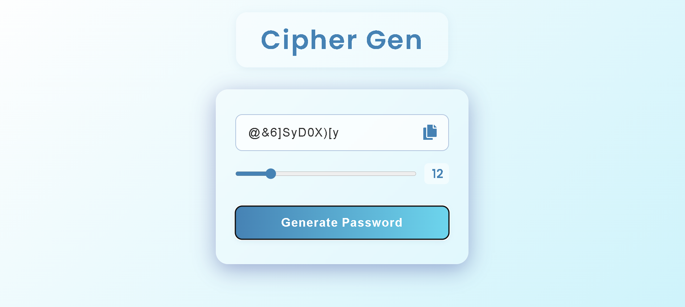

# 🔐 Cipher Gen

A modern, stylish password generator built with HTML, CSS, and JavaScript.



## 🚀 Features

- **Instant Password Generation:** Create strong, random passwords with a single click.
- **Custom Length:** Use the slider to choose password length (6–40 characters).
- **Easy Copy:** Copy passwords to your clipboard with one click.
- **Responsive Design:** Looks great on desktop and mobile.
- **Beautiful UI:** Glassmorphism effect, smooth transitions, and modern fonts.

## 🖼️ Preview


## 📦 Installation

1. **Clone the repository:**
   ```bash
   git clone https://github.com/your-github-username/cipherGen.git
   ```
2. **Open `index.html` in your browser.**

## 🛠️ Technologies Used

- HTML5
- CSS3 (Glassmorphism, gradients, responsive)
- JavaScript (ES6)
- [Font Awesome](https://fontawesome.com/) for icons
- [Google Fonts: Poppins](https://fonts.google.com/specimen/Poppins)

## ✨ How to Use

1. Set your desired password length using the slider.
2. Click **Generate Password**.
3. Click the copy icon to copy your password.

## 📄 License

This project is licensed under the [MIT License](LICENSE).

---

> **Made with ❤️ by [anurag](https://github.com/onurags)**